# Creating publication quality graphics

<!--sec data-title="Learning Objectives" data-id="obj" data-show=true data-collapse=false ces-->

* To be able to use ggplot2 to generate publication quality graphics
* To understand the basics of the grammar of graphics:
   - The aesthetics layer
   - The geometry layer
   - Adding statistics
   - Transforming scales
   - Coloring or paneling by groups.

<!--endsec-->

 

---

**Table of Contents**

<!-- toc -->

 

---

Plotting our data is one of the best ways to
quickly explore it and the various relationships
between variables.

There are three main plotting systems in R,
the [base plotting system][base], the [lattice][lattice]
package, and the [ggplot2][ggplot2] package.

[base]: http://www.statmethods.net/graphs/
[lattice]: http://www.statmethods.net/advgraphs/trellis.html
[ggplot2]: http://www.statmethods.net/advgraphs/ggplot2.html

Today we'll be learning about the ggplot2 package, because
it is the most effective for creating publication quality
graphics.

ggplot2 is built on the grammar of graphics, the idea that any plot can be
expressed from the same set of components: a **data** set, a
**coordinate system**, and a set of **geoms**--the visual representation of data
points.

The key to understanding ggplot2 is thinking about a figure in layers: just like
you might do in an image editing program like Photoshop, Illustrator, or
Inkscape.

Let's start off with an example:

~~~sourcecode
library("ggplot2")
ggplot(data = titanic, aes(x = Age, y = Fare)) +
  geom_point()
~~~

~~~err
Warning: Removed 177 rows containing missing values (geom_point).

~~~

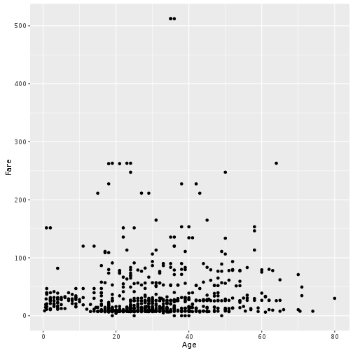

So the first thing we do is call the `ggplot` function. This function lets R
know that we're creating a new plot, and any of the arguments we give the
`ggplot` function are the *global* options for the plot: they apply to all
layers on the plot.

We've passed in two arguments to `ggplot`. First, we tell `ggplot` what data we
want to show on our figure, in this example the titanic data we read in
earlier. For the second argument we passed in the `aes` function, which
tells `ggplot` how variables in the **data** map to *aesthetic* properties of
the figure, in this case the **x** and **y** locations. Here we told `ggplot` we
want to plot the "Age" column of the titanic data frame on the x-axis, and
the "Fare" column on the y-axis. Notice that we didn't need to explicitly
pass `aes` these columns (e.g. `x = titanic[, "Age"]`), this is because
`ggplot` is smart enough to know to look in the **data** for that column!

By itself, the call to `ggplot` isn't enough to draw a figure:

~~~sourcecode
ggplot(titanic,aes(x = Age, y = Fare))
~~~

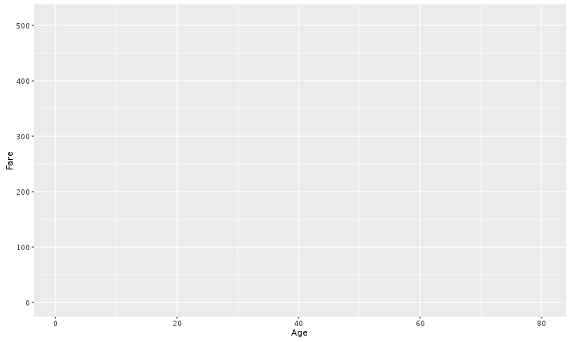

We need to tell `ggplot` how we want to visually represent the data, which we
do by adding a new **geom** layer. In our example, we used `geom_point`, which
tells `ggplot` we want to visually represent the relationship between **x** and
**y** as a scatterplot of points:

~~~sourcecode
ggplot(titanic,aes(x = Age, y = Fare)) +
  geom_point()
~~~

~~~err
Warning: Removed 177 rows containing missing values (geom_point).

~~~

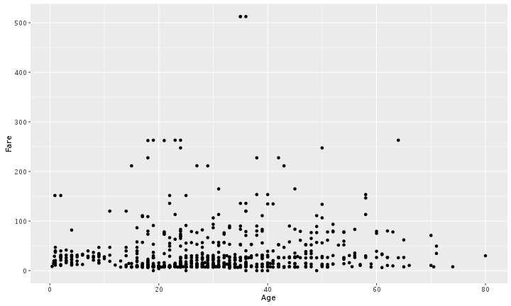

<!--sec data-title="Challenge 1" data-id="ch1" data-show=true data-collapse=false ces-->

Customize the basic setting (size = 2, alpha = 0.2, or col = “red”) in the aesthetics (`aes()`) argument and have a look at what happens. Change `geom_point()` to `geom_jitter()`. Can you explain the difference?

~~~sourcecode
ggplot(titanic, aes(x = Age, y = Fare, alpha = 0.2))+
  geom_jitter()
~~~

<!--endsec-->

<!--sec data-title="Challenge 2" data-id="ch2" data-show=true data-collapse=false ces-->

In the previous examples and challenge we've used the `aes` function to tell the scatterplot **geom** about the **x** and **y** locations of each point.
Another *aesthetic* property we can modify is the point *color*. Modify the
code from the previous challenge to **color** the points by the "Pclass"
column.

**HINT**: transform the Pclass column to a factor using the `as.factor()` function.

<!--endsec-->

 

---

## Layers

We could also make a line plot.
Instead, let's tell `ggplot` to visualise the data as a line plot:

~~~sourcecode
ggplot(titanic, aes(x = Age, y = Fare, col = as.factor(Pclass)))+
  geom_line()
~~~

~~~err
Warning: Removed 177 rows containing missing values (geom_path).

~~~

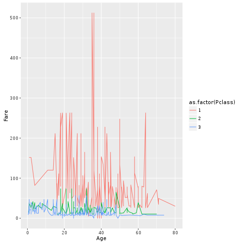

Instead of adding a `geom_point` layer, we've added a `geom_line` layer. 

But what if we want to visualise both lines and points on the plot? We can
simply add another layer to the plot:

~~~sourcecode
ggplot(titanic, aes(x = Age, y = Fare, col = as.factor(Pclass)))+
  geom_point() + geom_line()
~~~

~~~err
Warning: Removed 177 rows containing missing values (geom_point).

~~~

~~~err
Warning: Removed 177 rows containing missing values (geom_path).

~~~

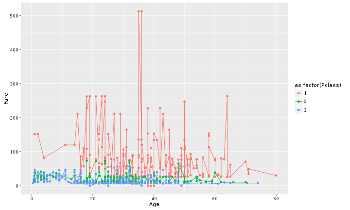

It's important to note that each layer is drawn on top of the previous layer. In
this example, the points have been drawn *on top of* the lines. Here's a
demonstration:

~~~sourcecode
ggplot(titanic, aes(x = Age, y = Fare ))+
  geom_point() + geom_line(aes(col = as.factor(Pclass)))
~~~

~~~err
Warning: Removed 177 rows containing missing values (geom_point).

~~~

~~~err
Warning: Removed 177 rows containing missing values (geom_path).

~~~

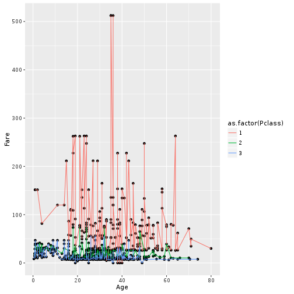

In this example, the *aesthetic* mapping of **color** has been moved from the
global plot options in `ggplot` to the `geom_line` layer so it no longer applies
to the points. Now we can clearly see that the points are drawn on top of the
lines.

<!--sec data-title="Challenge 3" data-id="ch3" data-show=true data-collapse=false ces-->

Switch the order of the point and line layers from the previous example. What happened?

<!--endsec-->

 

---

## Transformations and statistics

Ggplot also makes it easy to overlay statistical models over the data. To
demonstrate we'll go back to our first example:

~~~sourcecode
ggplot(titanic, aes(x = Age, y = Fare, col = as.factor(Pclass)))+
  geom_point()
~~~

~~~err
Warning: Removed 177 rows containing missing values (geom_point).

~~~

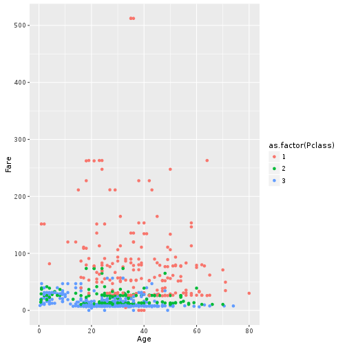

We can fit a simple relationship to the data by adding another layer,
`geom_smooth`:

~~~sourcecode
ggplot(titanic, aes(x = Age, y = Fare, col = as.factor(Pclass)))+
  geom_point() + geom_smooth(method = "lm")
~~~

~~~err
Warning: Removed 177 rows containing non-finite values (stat_smooth).

~~~

~~~err
Warning: Removed 177 rows containing missing values (geom_point).

~~~

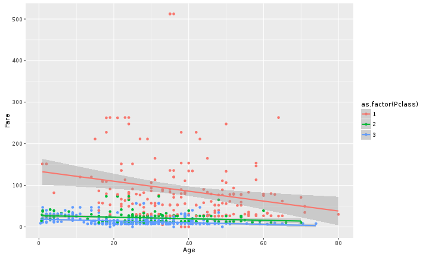

We can make the line thicker by *setting* the **size** and **se** aesthetic in the
`geom_smooth` layer:

~~~sourcecode
ggplot(titanic, aes(x = Age, y = Fare, col = as.factor(Pclass)))+
  geom_point() + geom_smooth(method = "lm", size =1.5, se = F)
~~~

~~~err
Warning: Removed 177 rows containing non-finite values (stat_smooth).

~~~

~~~err
Warning: Removed 177 rows containing missing values (geom_point).

~~~

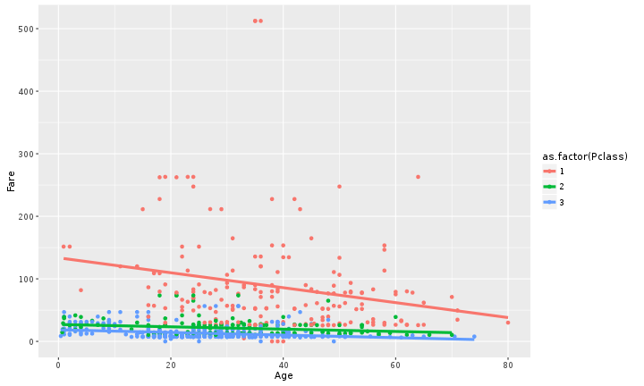

There are two ways an *aesthetic* can be specified. Here we *set* the **size**
aesthetic by passing it as an argument to `geom_smooth`. Previously in the
lesson we've used the `aes` function to define a *mapping* between data
variables and their visual representation.

 

---

## Multi-panel figures

Earlier we visualised the change in Fare across Age levels
in one plot. Alternatively, we can split out different groups in the data into multiple panels
by adding a layer of **facet** panels:

~~~sourcecode
ggplot(titanic, aes(x = Age, y = Fare, col = as.factor(Pclass)))+
  geom_point() + geom_smooth(method = "lm", size =1.5, se = F) +
  facet_grid(.~Pclass)
~~~

~~~err
Warning: Removed 177 rows containing non-finite values (stat_smooth).

~~~

~~~err
Warning: Removed 177 rows containing missing values (geom_point).

~~~

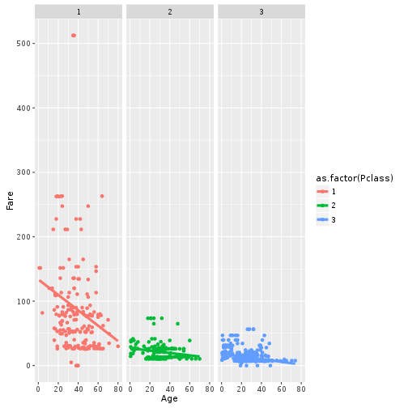

The `facet_grid` layer took a "formula" as its argument, denoted by the tilde
(~). This tells R to draw a panel for each unique value in the Pclass column
of the titanic dataset.

 

---

## Modifying text

To clean this figure up for a publication we need to change some of the text
elements. 

We can do this by adding a couple of different layers. The **theme** layer
controls the axis text, and overall text size, and there are special layers
for changing the axis labels. To change the legend title, we need to use the
**scales** layer.

~~~sourcecode
ggplot(titanic, aes(x = Age, y = Fare, col = as.factor(Pclass)))+
  geom_point() + geom_smooth(method = "lm", size =1.5, se = F) +
  facet_grid(.~Pclass)+
  scale_colour_discrete(name = "Passenger Classes", labels = c("First Class", "Second Class", "Third Class"))
~~~

~~~err
Warning: Removed 177 rows containing non-finite values (stat_smooth).

~~~

~~~err
Warning: Removed 177 rows containing missing values (geom_point).

~~~

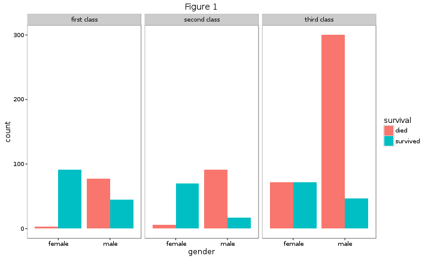

Next, we need to set the background as blank. Actually, we can save all `theme` settings in one variable.

~~~sourcecode
theme1 <- theme(panel.background = element_blank(),
               legend.background = element_blank(),
               panel.grid = element_blank())

ggplot(titanic, aes(x = Age, y = Fare, col = as.factor(Pclass)))+
  geom_point() + geom_smooth(method = "lm", size =1.5, se = F) +
  facet_grid(.~Pclass)+ xlab("Passsengers Age") +ylab("Fare") + ggtitle("Figure 1")+
  scale_colour_discrete(name = "Passengers Class", labels = c("First Class", "Second Class", "Third Class")) +
  theme1
~~~

~~~err
Warning: Removed 177 rows containing non-finite values (stat_smooth).

~~~

~~~err
Warning: Removed 177 rows containing missing values (geom_point).

~~~

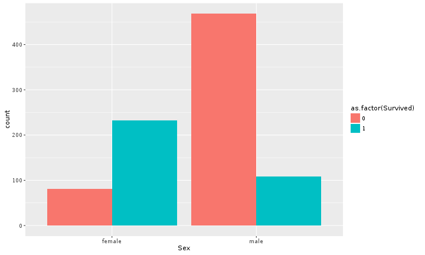

This is just a taste of what you can do with `ggplot2`. RStudio provides a
really useful [cheat sheet][cheat] of the different layers available, and more
extensive documentation is available on the [ggplot2 website][ggplot-doc].
Finally, if you have no idea how to change something, a quick google search will
usually send you to a relevant question and answer on Stack Overflow with reusable
code to modify!

[cheat]: http://www.rstudio.com/wp-content/uploads/2015/03/ggplot2-cheatsheet.pdf
[ggplot-doc]: http://docs.ggplot2.org/current/

 

---

## Challenge solutions

<!--sec data-title="Solution to Challenge 1" data-id="ch1sol" data-show=true data-collapse=true ces-->

~~~sourcecode
ggplot(titanic, aes(x = Age, y = Fare, size = 2))+
  geom_point()
~~~

~~~err
Warning: Removed 177 rows containing missing values (geom_point).

~~~

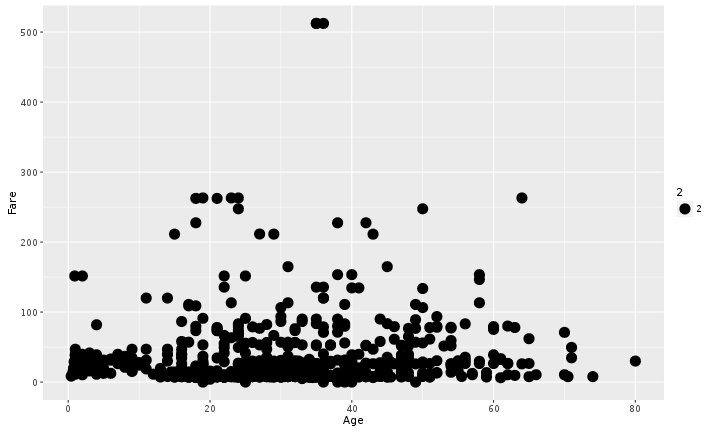

~~~sourcecode
ggplot(titanic, aes(x = Age, y = Fare, alpha = 0.2))+
  geom_point()
~~~

~~~err
Warning: Removed 177 rows containing missing values (geom_point).

~~~

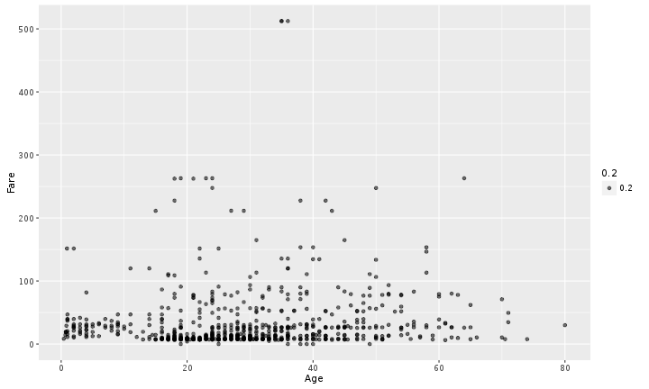

~~~sourcecode
ggplot(titanic, aes(x = Age, y = Fare, col = "red"))+
  geom_point()
~~~

~~~err
Warning: Removed 177 rows containing missing values (geom_point).

~~~

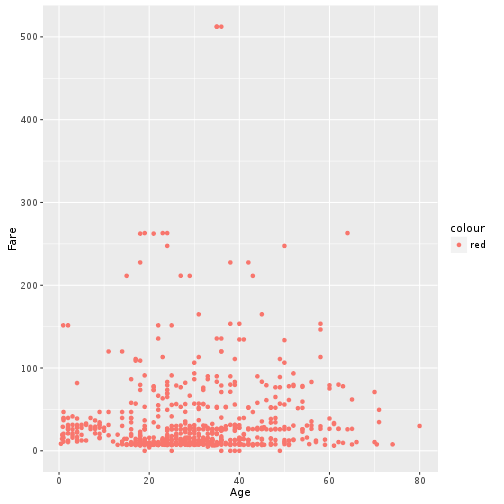

<!--endsec-->

<!--sec data-title="Solution to Challenge 2" data-id="ch2sol" data-show=true data-collapse=true ces-->

~~~sourcecode
ggplot(titanic, aes(x = Age, y = Fare, col = as.factor(Pclass)))+
  geom_point()
~~~

~~~err
Warning: Removed 177 rows containing missing values (geom_point).

~~~

<!--endsec-->

<!--sec data-title="Solution to Challenge 3" data-id="ch3sol" data-show=true data-collapse=true ces-->

Switch the order of the point and line layers from the previous example. What happened?

~~~sourcecode
ggplot(titanic, aes(x = Age, y = Fare )) + 
  geom_line(aes(col = as.factor(Pclass)))+geom_point()
~~~

~~~err
Warning: Removed 177 rows containing missing values (geom_path).

~~~

~~~err
Warning: Removed 177 rows containing missing values (geom_point).

~~~

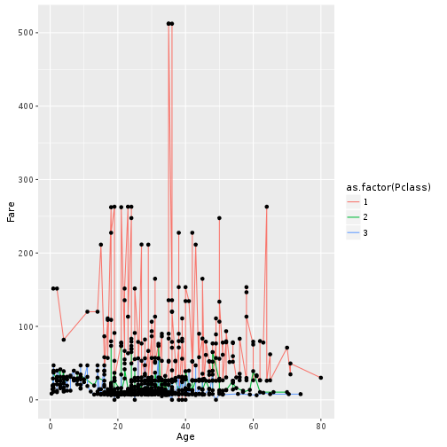
 
The lines now get drawn over the points!

<!--endsec-->
